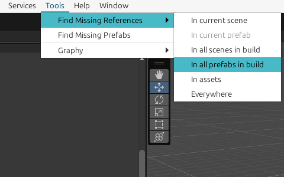

# Helmet-mounted Display (Aerial Vehicle)

## *HPVDT, University of Toronto*

## How to compile

- `git clone <this project> --recursive`
- `git checkout <your development branch>`
- `git submodule update --init --recursive`
- Open this directory with the latest Unity editor 2022 LTS
- Select your favourite IDE in menu `Editor/Preferences/External Tools`
- Open with IDE by selecting `Assets/Open C# Project`

## How to contribute

- For every new feature or patch, always `git checkout <a new branch>`
- Edit and test your changes with your favourite tools, recommended tools are:

  - Unity Engine:
    - Eidtor 2022 LTS
    - OpenUPM
  - IDE:
    - JetBrains Riders
    - Visual Studio 2022
    - Visual Studio Code
  - Git GUI:
    - JetBrains Riders (again)
    - GitKraken
  - Documentation
    - Obsidian
- For all changes, `git add *` & `git commit`
- `git push` and submit a PR (pull request)
- To keep up your branch with the latest version, `git rebase` all commits of your branch with squashing

  - For beginners, this should be performed with a Git GUI

## Code Discipline

We rely heavily on static analysis and autoformalisation tools to ensure correspondence between concurrent patches and software capabilities, and try to capture every low-level mistakes ASAP:

- in your IDE, always set Action-on-Save to "reformat and apply style" using `.editorconfig` file as the only format definition
- For every mandatory Unity reference to be set in Unity Editor:
  - use [Required] attribute to warn user on program initialisation if the field is not set
  - use [Autofill] attribute to automatically link to a nearby Unity component
- For every pre-existing Unity reference:
  - Use "Find Missing References" tool to detect broken references in scenes & prefabs

- **Unity reference between objects in different assets is strictly forbidden**, object UUID backlinks are only checked WITHIN an asset and will become broken on git merge/rebase. **The only exception to this rule are prefabs**

## Communication

- Project status: https://github.com/orgs/hpvdt/projects/2
- Feel free to propose new feature & hotfix as task list items
- Please be nice be respectful, particularly to all test pilots (Calvin, Bill, Claire) who are risking their lives to
  push the envelop

### How to ask a good question

- Go to project status page: https://github.com/orgs/hpvdt/projects/2
- Select the component you intend to ask about (under `TODO` tab, enclosed in `[]`, e.g. `[Pilot UI]` and `[Telemetry]`)
- Find the owner/assignee of the component on the same page
- post your question under the same page, or ask the owner directly via Discord.
